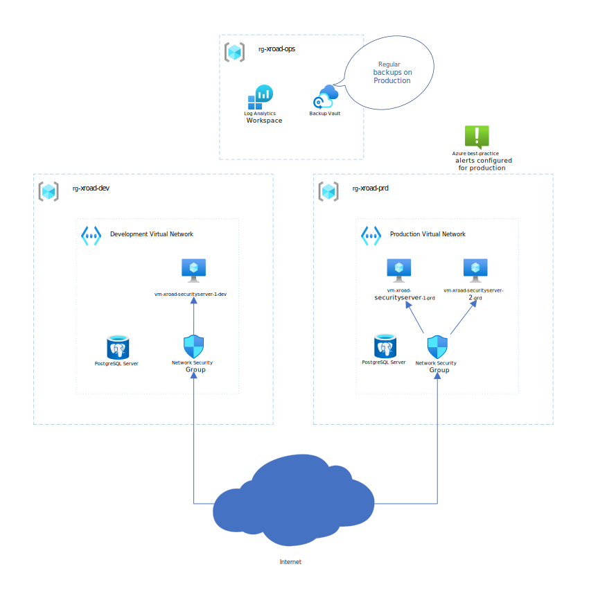

# Introduction 
This repository is intended to get you up and running with an Icelandic X-Road SecurityServer in Azure.

Executing the Azure CLI commands under Deploy in a PowerShell will create a development environment for X-Road in your cloud environment. \
Later on you can run these commands again from the same machine using "both" as your deployment_type to add the production servers.

## Architecture drawing
The following shows the end product in Azure of a full deployment for both dev/prd.



## Pricing Estimate
Estimated cost of Azure infrastructure costs with reservations in place. \
Costs can be assumed to be 10% higher when including logs and data transfer

https://azure.com/e/6b47eb8c5a2d4ce690586fadf78d7da3

## Resource sizing
The modules defaults provide for very modest compute and database resources. \
Scale-up as appropriate.

## HA / LB
While the production environment is deployed in a fault-tolerant redundant fashion, it is not load balanced. \
To support exposing particularly popular X-Road APIs consider adding an Application Layer Gateway as load balancer as well as reviewing the documentation here.

https://www.niis.org/blog/2018/6/25/balancing-the-load \
https://docs.devland.is/products/x-road/straumurinn-usage-and-operation#innbyggd-alagsdreifing

# Requirements
An Azure subscription, preferably an empty one dedicated for this project.

Owner permissions on that subscription

Registration with island.is for Strauminn

# Getting Started
winget install -e --id Microsoft.AzureCLI \
winget install -e --id=Hashicorp.Terraform

It is recommended to contact island.is early in the process but there are also more detailed instructions on the post-install registration process here \
https://docs.devland.is/products/x-road/x-road-security-server-installation-and-registration-steps#network-configuration

# Deploy
Example assumes PowerShell Core \
Make sure to replace all variable values as applicable (and see variables.tf in the repository root for additional options)


```powershell
$username = "executing@user.org"
$actiongroup_email = "alertgroup@user.org"
$organization = "Well Advised ehf"
$organization_dns_fragment = "wa"
# Specify "both" to create/add both the dev and prd environment. 
# The default of dev is provided for cost reasons in case of a long period of development.
$deployment_type = "dev"

$azSubscriptionId = "00000000-0000-0000-0000-000000000000"
az login
az account set -s $azSubscriptionId

# X-Road Web Administration Passowrd
$xrd_webadmin_password = "xxx"
# PostgreSql password
$psql_password = "xxx"
$vm_username = "gunni"
# SSH Public key authentication is preferred for the Ubuntu server, alternatively configure vm_password
$ssh_pubkey = "ssh-rsa AAAABxxxxxxlongbase64string gunni"
# Specify the networks or addresses that can access the web administration and ssh server
$firewall_whitelist = '["1.1.1.0/29","1.0.0.1"]'
# Configure the network addresses to use for X-Road. 
# Likely to require planning and consideration of current on-prem addressing.
$vnetDevAddressPrefix = "10.83.140.0/23"
$vmDevSubnetAddressPrefix = "10.83.140.0/24"
$psqlDevSubnetAddressPrefix = "10.83.141.0/24"
$vnetPrdAddressPrefix = "10.83.142.0/23"
$vmPrdSubnetAddressPrefix = "10.83.142.0/24"
$psqlPrdSubnetAddressPrefix = "10.83.143.0/24"

terraform init
terraform apply `
  -var="username=$username" `
  -var="organization=$organization" `
  -var="organization_dns_fragment=$organization_dns_fragment" `
  -var="deployment_type=$deployment_type" `
  -var="xrd_webadmin_password=$xrd_webadmin_password" `
  -var="psql_password=$psql_password" `
  -var="ssh_pubkey=$ssh_pubkey" `
  -var="vm_username=$vm_username" `
  -var="firewall_whitelist=$firewall_whitelist" `
  -var="vnetDevAddressPrefix=$vnetDevAddressPrefix" `
  -var="vmDevSubnetAddressPrefix=$vmDevSubnetAddressPrefix" `
  -var="psqlDevSubnetAddressPrefix=$psqlDevSubnetAddressPrefix" `
  -var="vnetPrdAddressPrefix=$vnetPrdAddressPrefix" `
  -var="vmPrdSubnetAddressPrefix=$vmPrdSubnetAddressPrefix" `
  -var="firewall_whitelist=$firewall_whitelist" `
  -var="psqlPrdSubnetAddressPrefix=$psqlPrdSubnetAddressPrefix" `
  -var="actiongroup_email=$actiongroup_email"
```

# X-Road Server post-install
After the deploy step, you will be at this step in the island.is docs \
https://docs.devland.is/products/x-road/x-road-security-server-installation-and-registration-steps#registration-email-for-security-server-to-central-example

"In the next screen a configuration anchor is requested. Upload the configuration anchor from the central server." \
See section 2 in this link for the configuration anchor relevant to your environment \
https://github.com/digitaliceland/Straumurinn?tab=readme-ov-file#getting-started-installing-security-server-and-intial-configuration

Consider Azure reservations to bring down costs of Azure VM Compute

# ToDo
Verify sensible defaults for psql SKU

TF started supporting total_retention_in_days in the latest version \
But doesn't support the full range \
https://github.com/hashicorp/terraform-provider-azurerm/issues/24860

## Other
xroad VM spec recommendations: \
vCPU 2-8 \
mem 4-16

Ubuntu automatic updates are configured to allow for automatic restarts at 0400 in the event of a security patch requiring a kernel update \
This can be overriden using the automatic_update_reboot_time parameter.

See variables.tf for other overridable defaults

# Env specific
## Production
Backups \
Alerting

## Development
Auto-Shutdown @ 2300
